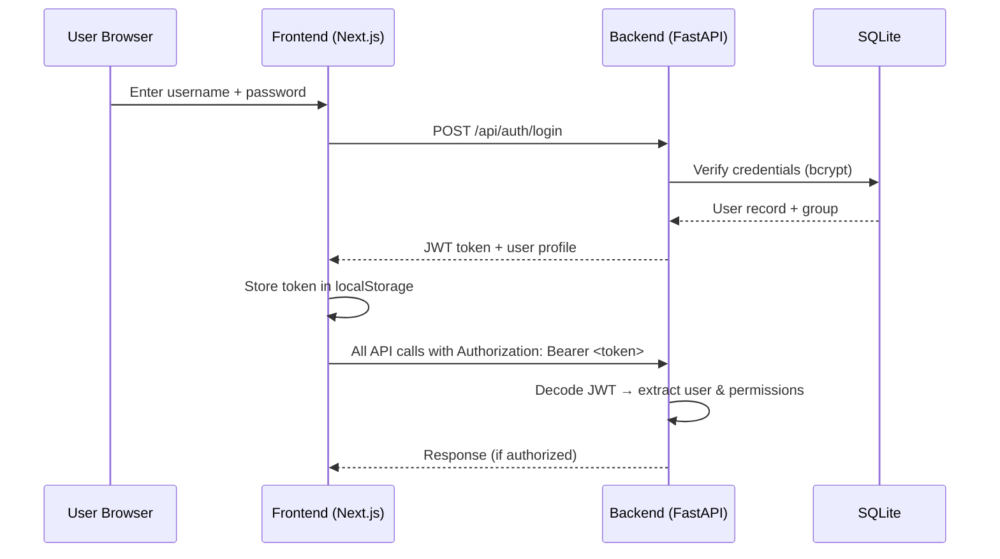

# AI Compliance Platform — Complete Documentation Guide

> **Version:** 2.0 · **Date:** October 2026 · **Status:** Live Demo Ready  
> **New in v2.0:** Security Layer (JWT + RBAC), Costing Expert Engine, Role-Based Dashboards

---

## Table of Contents

1. [Architecture Overview](#1-architecture-overview)
2. [Project Structure](#2-project-structure)
3. [Sample Source Documents](#3-sample-source-documents)
4. [Report Templates](#4-report-templates)
5. [Setup & Installation](#5-setup--installation)
6. [Step-by-Step Testing Guide](#6-step-by-step-testing-guide)
7. [RAG Query Examples](#7-rag-query-examples)
8. [Report Generation Walkthrough](#8-report-generation-walkthrough)
9. [LLM Provider Configuration](#9-llm-provider-configuration)
10. [API Reference](#10-api-reference)
11. [Troubleshooting](#11-troubleshooting)
12. [Security Layer & RBAC](#12-security-layer--rbac) ⭐ NEW
13. [Costing Expert Engine](#13-costing-expert-engine) ⭐ NEW
14. [UI Function Specifications](#14-ui-function-specifications) ⭐ NEW
15. [Sample Data Catalog](#15-sample-data-catalog) ⭐ NEW
16. [JEV Multi-Model Router](#16-jev-multi-model-router)

---

## 1. Architecture Overview

```
┌──────────────────────────────────────────────────────────────────┐
│                      FRONTEND (Next.js)                          │
│  ┌────────┐ ┌──────┐ ┌──────┐ ┌──────┐ ┌──────┐ ┌───────────┐ │
│  │ Login  │ │ Docs │ │Query │ │Report│ │Admin │ │ Cost/Dash │ │
│  │  Page  │ │Upload│ │ Tab  │ │ Tab  │ │Panel │ │   Board   │ │
│  └───┬────┘ └──┬───┘ └──┬───┘ └──┬───┘ └──┬───┘ └─────┬─────┘ │
└──────┼─────────┼────────┼────────┼────────┼───────────┼────────┘
       │         │        │        │        │           │
       ▼         ▼        ▼        ▼        ▼           ▼
┌──────────────────────────────────────────────────────────────────┐
│                    BACKEND (FastAPI)                              │
│                                                                  │
│  ┌─────────┐  ┌──────────┐  ┌──────────────┐  ┌──────────────┐ │
│  │ auth.py │  │ main.py  │  │cost_manager.py│  │ database.py  │ │
│  │JWT+RBAC │  │RAG+LLM   │  │Token Tracking │  │SQLite Models │ │
│  └────┬────┘  └────┬─────┘  └──────┬───────┘  └──────┬───────┘ │
└───────┼────────────┼───────────────┼─────────────────┼─────────┘
        │            │               │                 │
        ▼            ▼               ▼                 ▼
┌────────────┐ ┌────────────┐ ┌────────────────────────────────┐
│  SQLite    │ │  ChromaDB  │ │     Embedding Engine (Ollama)  │
│ platform.db│ │ Vectors    │ │   nomic-embed-text:latest      │
└────────────┘ └────────────┘ └────────────────────────────────┘
```

### RAG Pipeline Flow

```
User Login (JWT) → Authenticated Request → Document Upload → Text Extraction
        → Chunking → Embedding → ChromaDB
                                       │
Query → Embed Query → Similarity Search (ChromaDB) → Top-K Chunks
                                       │
                  LLM Synthesis (with citations) ←──┘
                                       │
           Token Counting → Cost Calculation → Usage Log (SQLite)
                                       │
                  Template Filling → Report Output ←──────┘
```

---

## 2. Project Structure

```
ai-compliance-platform/
│
├── backend/
│   ├── main.py                    ← FastAPI app (RAG pipeline, all endpoints)
│   ├── database.py                ← SQLite models, init, seed data (NEW)
│   ├── auth.py                    ← JWT auth, RBAC middleware (NEW)
│   ├── cost_manager.py            ← Token tracking, cost engine (NEW)
│   ├── platform.db                ← SQLite database file (auto-created)
│   ├── .env                       ← Environment config
│   └── requirements.txt
│
├── frontend/
│   ├── app/
│   │   └── page.tsx               ← Full UI (Login + Tabs + Admin + Dashboard)
│   ├── package.json
│   └── .env.local
│
├── templates/                     ← Report templates (MD, PDF, DOCX)
│   ├── comprehensive_compliance_audit_template.md
│   ├── digital_assets_aml_template.md
│   ├── financial_performance_audit_template.md
│   └── report_template.md
│
├── vectorstore/
│   ├── chroma_db/                 ← ChromaDB persistent storage
│   └── demo/
│       ├── raw/                   ← Source documents for RAG
│       └── reports/               ← Generated output reports
│
├── sample_documents/              ← Human-readable source document content
├── scripts/                       ← Utility scripts
└── configs/
    └── llm_config.json            ← Saved LLM provider settings
```

---

## 3–11. [Original Sections Preserved]

> Sections 3 through 11 remain as documented in v1.0. See the original document for:
> - Sample Source Documents (§3)
> - Report Templates (§4)
> - Setup & Installation (§5) — *now includes `pip install pyjwt passlib[bcrypt]`*
> - Step-by-Step Testing Guide (§6)
> - RAG Query Examples (§7)
> - Report Generation Walkthrough (§8)
> - LLM Provider Configuration (§9)
> - API Reference (§10) — *expanded below in §12-13*
> - Troubleshooting (§11)

---

## 12. Security Layer & RBAC

### 12.1 Authentication Flow



### 12.2 JWT Token Structure

```json
{
  "sub": 1,
  "username": "admin",
  "group": "admin",
  "exp": 1727961600,
  "iat": 1727875200
}
```

| Field | Description |
|-------|-------------|
| `sub` | User ID (integer) |
| `username` | Login username |
| `group` | Group name (admin/management/group_head/normal_user) |
| `exp` | Expiry timestamp (24 hours from creation) |
| `iat` | Issued-at timestamp |

### 12.3 Group Definitions

| Group | Name | Description | Dashboard Scope |
|-------|------|-------------|-----------------|
| 1 | `admin` | Full system administrator | All org data |
| 2 | `management` | Management & oversight | Org-level view |
| 3 | `group_head` | Team/department leader | Team-level view |
| 4 | `normal_user` | Standard platform user | Personal view only |

### 12.4 Permissions Matrix

| Permission | Admin | Management | Group Head | Normal User |
|------------|:-----:|:----------:|:----------:|:-----------:|
| `run_queries` | ✅ | ✅ | ✅ | ✅ |
| `generate_reports` | ✅ | ✅ | ✅ | ✅ |
| `download_reports` | ✅ | ✅ | ✅ | ✅ |
| `view_dashboard` | all | org | team | personal |
| `view_all_usage` | ✅ | ✅ | ❌ | ❌ |
| `view_team_usage` | ✅ | ✅ | ✅ | ❌ |
| `manage_users` | ✅ | ❌ | ❌ | ❌ |
| `manage_groups` | ✅ | ❌ | ❌ | ❌ |
| `manage_costs` | ✅ | ❌ | ❌ | ❌ |

### 12.5 Default User Accounts (Seeded)

| Username | Password | Email | Group | Purpose |
|----------|----------|-------|-------|---------|
| `admin` | `admin123` | admin@platform.local | Admin | Full system access |
| `manager1` | `manager123` | manager1@platform.local | Management | Org-level oversight |
| `head1` | `head123` | head1@platform.local | Group Head | Team leader |
| `analyst1` | `analyst123` | analyst1@platform.local | Group Head | Second team leader |
| `user1` | `user123` | user1@platform.local | Normal User | Standard analyst |
| `user2` | `user123` | user2@platform.local | Normal User | Standard analyst |

### 12.6 Auth API Endpoints

| Method | Endpoint | Auth Required | Permission | Description |
|--------|----------|:------------:|------------|-------------|
| POST | `/api/auth/login` | ❌ | — | Login, returns JWT |
| POST | `/api/auth/logout` | ✅ | — | Logout (stateless) |
| GET | `/api/auth/me` | ✅ | — | Current user profile |
| POST | `/api/admin/users` | ✅ | `manage_users` | Create user |
| GET | `/api/admin/users` | ✅ | `manage_users` | List all users |
| PUT | `/api/admin/users/{id}` | ✅ | `manage_users` | Update user |
| DELETE | `/api/admin/users/{id}` | ✅ | `manage_users` | Deactivate user |
| GET | `/api/admin/groups` | ✅ | — | List all groups |

### 12.7 Login Request/Response Examples

**Request:**
```json
POST /api/auth/login
{
  "username": "admin",
  "password": "admin123"
}
```

**Response (200 OK):**
```json
{
  "token": "eyJhbGciOiJIUzI1NiIsInR5cCI6IkpXVCJ9...",
  "user": {
    "id": 1,
    "username": "admin",
    "email": "admin@platform.local",
    "group": "admin",
    "permissions": {
      "manage_users": true,
      "manage_groups": true,
      "manage_costs": true,
      "view_all_usage": true,
      "view_team_usage": true,
      "run_queries": true,
      "generate_reports": true,
      "download_reports": true,
      "view_dashboard": "all"
    }
  }
}
```

**Error (401):**
```json
{
  "detail": "Invalid username or password"
}
```

### 12.8 Create User Example (Admin Only)

**Request:**
```json
POST /api/admin/users
Authorization: Bearer <admin-jwt-token>
{
  "username": "newuser",
  "email": "newuser@company.com",
  "password": "securepass456",
  "group_name": "normal_user"
}
```

**Response:**
```json
{
  "id": 7,
  "username": "newuser",
  "email": "newuser@company.com",
  "group": "normal_user",
  "is_active": true
}
```

---

## 13. Costing Expert Engine

### 13.1 Token Cost Architecture

```
Query/Report Request
        │
        ▼
┌─────────────────┐     ┌────────────────────┐
│ estimate_tokens()│────▶│ get_cost_for_model()│
│ len(text) / 4    │     │ Lookup cost_config  │
└─────────────────┘     └────────────────────┘
        │                         │
        ▼                         ▼
┌──────────────────────────────────────┐
│           log_usage()                 │
│  input_tokens × input_cost_per_1k    │
│  output_tokens × output_cost_per_1k  │
│  total_cost = input_cost + output_cost│
│         ↓                            │
│    INSERT INTO usage_logs            │
└──────────────────────────────────────┘
```

### 13.2 Default Token Pricing Table

| Provider | Model | Input $/1K tokens | Output $/1K tokens | Notes |
|----------|-------|:-----------------:|:------------------:|-------|
| openai | gpt-4o | $0.0025 | $0.0100 | Frontier |
| openai | gpt-4o-mini | $0.00015 | $0.0006 | Budget |
| openai | gpt-4-turbo | $0.0100 | $0.0300 | Legacy |
| openai | gpt-3.5-turbo | $0.0005 | $0.0015 | Legacy |
| google | gemini-1.5-flash | $0.000075 | $0.0003 | Cheapest cloud |
| google | gemini-1.5-pro | $0.00125 | $0.0050 | Pro tier |
| google | gemini-1.0-pro | $0.0005 | $0.0015 | Legacy |
| anthropic | claude-3.5-sonnet | $0.003 | $0.015 | Best reasoning |
| anthropic | claude-3-haiku | $0.00025 | $0.00125 | Fast |
| anthropic | claude-3-opus | $0.015 | $0.075 | Premium |
| deepseek | deepseek-chat | $0.00014 | $0.00028 | Ultra-low cost |
| deepseek | deepseek-reasoner | $0.00055 | $0.00219 | Reasoning |
| ollama | *(all models)* | $0.00 | $0.00 | Free (local) |

> [!TIP]
> Admin can update these rates anytime via the Cost Configuration screen. Rates are stored in the `cost_config` database table and apply to all future usage calculations.

### 13.3 Custom Cost Components

Admin-configurable additional costs beyond LLM token usage:

| Cost Name | Description | Amount (USD) | Frequency |
|-----------|-------------|:------------:|-----------|
| Cloud Storage (S3) | AWS S3 for vectorstore & documents | $25.00 | Monthly |
| Embedding Compute | Ollama embedding server compute | $0.00 | Monthly |
| ChromaDB Hosting | Vector database hosting | $15.00 | Monthly |
| Platform License | Base platform license fee | $500.00 | Monthly |

> [!NOTE]
> Admins can add, update, or remove custom costs. These are included in the total cost reports alongside LLM token costs.

### 13.4 Sample Usage Log Entry

```json
{
  "id": 42,
  "user_id": 5,
  "workspace": "demo",
  "provider": "google",
  "model": "gemini-1.5-flash",
  "query_type": "query",
  "query_text": "Show edge gateway latency metrics...",
  "input_tokens": 1250,
  "output_tokens": 380,
  "input_cost": 0.000094,
  "output_cost": 0.000114,
  "total_cost": 0.000208,
  "created_at": "2026-10-03T15:30:00"
}
```

### 13.5 Cost Report Structure

**GET /api/cost-report?period=monthly**

```json
{
  "period": "monthly",
  "date_range": {
    "from": "2026-10-01",
    "to": "2026-10-31"
  },
  "token_costs": {
    "total_queries": 247,
    "total_reports": 34,
    "total_input_tokens": 312500,
    "total_output_tokens": 98400,
    "total_token_cost": 4.82,
    "by_provider": [
      {"provider": "google", "queries": 120, "cost": 0.45},
      {"provider": "openai", "queries": 85, "cost": 3.12},
      {"provider": "deepseek", "queries": 30, "cost": 0.15},
      {"provider": "ollama", "queries": 12, "cost": 0.00},
      {"provider": "anthropic", "queries": 34, "cost": 1.10}
    ],
    "by_model": [
      {"model": "gemini-1.5-flash", "queries": 120, "cost": 0.45},
      {"model": "gpt-4o", "queries": 50, "cost": 2.50},
      {"model": "gpt-4o-mini", "queries": 35, "cost": 0.62}
    ],
    "by_user": [
      {"username": "admin", "queries": 45, "cost": 1.20},
      {"username": "user1", "queries": 89, "cost": 1.55},
      {"username": "analyst1", "queries": 67, "cost": 1.02}
    ]
  },
  "custom_costs": {
    "items": [
      {"name": "Cloud Storage (S3)", "amount": 25.00, "frequency": "monthly"},
      {"name": "ChromaDB Hosting", "amount": 15.00, "frequency": "monthly"},
      {"name": "Platform License", "amount": 500.00, "frequency": "monthly"}
    ],
    "total_custom": 540.00
  },
  "grand_total": 544.82
}
```

### 13.6 Dashboard Summary Structure

**GET /api/dashboard/summary** (role-aware)

```json
{
  "user": {
    "id": 1,
    "username": "admin",
    "group": "admin",
    "dashboard_scope": "all"
  },
  "stats": {
    "total_users": 6,
    "active_users_today": 4,
    "total_queries_today": 23,
    "total_queries_month": 247,
    "total_cost_today": 0.85,
    "total_cost_month": 544.82,
    "avg_cost_per_query": 0.019
  },
  "top_users": [
    {"username": "user1", "queries": 89, "cost": 1.55},
    {"username": "analyst1", "queries": 67, "cost": 1.02},
    {"username": "admin", "queries": 45, "cost": 1.20}
  ],
  "provider_distribution": [
    {"provider": "google", "percentage": 48.6, "queries": 120},
    {"provider": "openai", "percentage": 34.4, "queries": 85},
    {"provider": "anthropic", "percentage": 13.8, "queries": 34},
    {"provider": "ollama", "percentage": 3.2, "queries": 8}
  ],
  "cost_trend": [
    {"date": "2026-10-01", "cost": 18.20},
    {"date": "2026-10-02", "cost": 22.45},
    {"date": "2026-10-03", "cost": 15.80}
  ],
  "recent_activity": [
    {"user": "user1", "action": "query", "workspace": "demo", "time": "5 min ago", "cost": 0.003},
    {"user": "admin", "action": "report", "workspace": "demo", "time": "12 min ago", "cost": 0.025},
    {"user": "analyst1", "action": "query", "workspace": "demo", "time": "28 min ago", "cost": 0.001}
  ]
}
```

### 13.7 Cost API Endpoints

| Method | Endpoint | Auth | Permission | Description |
|--------|----------|:----:|------------|-------------|
| GET | `/api/admin/cost-config` | ✅ | `manage_costs` | List token costs |
| PUT | `/api/admin/cost-config` | ✅ | `manage_costs` | Update token cost |
| GET | `/api/admin/custom-costs` | ✅ | `manage_costs` | List custom costs |
| POST | `/api/admin/custom-costs` | ✅ | `manage_costs` | Add custom cost |
| PUT | `/api/admin/custom-costs/{id}` | ✅ | `manage_costs` | Update custom cost |
| DELETE | `/api/admin/custom-costs/{id}` | ✅ | `manage_costs` | Remove custom cost |
| GET | `/api/usage/my` | ✅ | — | My usage |
| GET | `/api/usage/team?period=month` | ✅ | `view_team_usage` | Team usage |
| GET | `/api/usage/all?period=month` | ✅ | `view_all_usage` | All usage |
| GET | `/api/cost-report?period=monthly` | ✅ | — | Cost report |
| GET | `/api/dashboard/summary` | ✅ | — | Dashboard data |

---

## 14. UI Function Specifications

### 14.1 Login Page

**Route:** Root page (shown when not authenticated)  
**Components:**

| Element | Type | Description |
|---------|------|-------------|
| Platform logo | Display | Gradient logo with "AI Compliance Platform" |
| Username field | Input | Text input, placeholder "Enter username" |
| Password field | Input | Password input with show/hide toggle |
| Login button | Button | Primary indigo, submits credentials |
| Error alert | Toast | Red alert on invalid credentials |
| Demo credentials | Help text | Shows default accounts for testing |

**Behaviour:**
1. User enters username + password → clicks Login
2. Frontend calls `POST /api/auth/login`
3. On success: store JWT + user in `localStorage`, redirect to main dashboard
4. On failure: show error toast "Invalid username or password"
5. On page load: check `localStorage` for valid token → auto-login

**State:**
```typescript
const [loginUsername, setLoginUsername] = useState("")
const [loginPassword, setLoginPassword] = useState("")
const [authToken, setAuthToken] = useState<string | null>(null)
const [currentUser, setCurrentUser] = useState<UserProfile | null>(null)
const [loginError, setLoginError] = useState<string | null>(null)
```

---

### 14.2 Navigation Bar (Updated)

**Changes from v1.0:**
- Add user avatar + name badge (right side)
- Add "Admin" tab (visible only to admin group)
- Add "Costs" tab (visible to all, content varies by role)
- Add "Dashboard" tab
- Add Logout button
- Show group badge next to username

**Tab Visibility by Group:**

| Tab | Admin | Management | Group Head | Normal User |
|-----|:-----:|:----------:|:----------:|:-----------:|
| Documents | ✅ | ✅ | ✅ | ✅ |
| Templates | ✅ | ✅ | ✅ | ✅ |
| Query | ✅ | ✅ | ✅ | ✅ |
| Report | ✅ | ✅ | ✅ | ✅ |
| Admin | ✅ | ❌ | ❌ | ❌ |
| Costs | ✅ | ✅ | ✅ | ✅ |
| Dashboard | ✅ | ✅ | ✅ | ✅ |

---

### 14.3 Admin Panel (Admin Only)

**Sub-tabs:**

#### 14.3.1 User Management

| Element | Type | Description |
|---------|------|-------------|
| Users table | DataTable | id, username, email, group, status, created_at |
| Create User button | Button | Opens modal with username, email, password, group select |
| Edit button (per row) | IconButton | Opens edit modal |
| Deactivate button | IconButton | Confirms then deactivates user |
| Group filter | Select | Filter table by group |

**Sample Table View:**

| # | Username | Email | Group | Status | Created |
|---|----------|-------|-------|--------|---------|
| 1 | admin | admin@platform.local | 🔴 Admin | Active | Oct 1, 2026 |
| 2 | manager1 | manager1@platform.local | 🟣 Management | Active | Oct 1, 2026 |
| 3 | head1 | head1@platform.local | 🔵 Group Head | Active | Oct 1, 2026 |
| 4 | analyst1 | analyst1@platform.local | 🔵 Group Head | Active | Oct 1, 2026 |
| 5 | user1 | user1@platform.local | 🟢 Normal User | Active | Oct 1, 2026 |
| 6 | user2 | user2@platform.local | 🟢 Normal User | Active | Oct 1, 2026 |

#### 14.3.2 Cost Configuration

| Element | Type | Description |
|---------|------|-------------|
| Token Costs table | DataTable | provider, model, input $/1K, output $/1K |
| Edit inline | Input | Admin can edit cost values directly |
| Save button | Button | Saves updated costs |
| Custom Costs section | DataTable | name, description, amount, frequency |
| Add Custom Cost | Button | Opens form modal |

**Sample Token Cost Table (editable):**

| Provider | Model | Input $/1K | Output $/1K | Action |
|----------|-------|:----------:|:----------:|--------|
| openai | gpt-4o | `0.0025` | `0.0100` | ✏️ Save |
| openai | gpt-4o-mini | `0.00015` | `0.0006` | ✏️ Save |
| google | gemini-1.5-flash | `0.000075` | `0.0003` | ✏️ Save |
| anthropic | claude-3.5-sonnet | `0.003` | `0.015` | ✏️ Save |
| deepseek | deepseek-chat | `0.00014` | `0.00028` | ✏️ Save |
| ollama | llama3.2 | `0.00` | `0.00` | ✏️ Save |

---

### 14.4 Cost Reports Screen

**Accessible to:** All authenticated users (scope varies by role)

| Element | Type | Description |
|---------|------|-------------|
| Period selector | Select | Today / This Week / This Month / Custom Range |
| Group filter | Select | All / Admin / Management / Group Head / Users (admin/mgmt only) |
| Summary cards | 4 Cards | Total Queries, Total Tokens, Token Cost, Grand Total |
| Provider chart | Bar Chart | Cost breakdown by provider |
| Model chart | Bar Chart | Cost breakdown by model |
| User table | DataTable | Usage & cost per user |
| Custom costs section | Summary | Monthly recurring costs |
| Download CSV | Button | Export full report as CSV |
| Download PDF | Button | Export formatted report |

**Summary Cards Layout:**

```
┌──────────────┐  ┌──────────────┐  ┌──────────────┐  ┌──────────────┐
│  📊 Total    │  │  🔤 Total    │  │  💰 Token    │  │  💎 Grand    │
│  Queries     │  │  Tokens      │  │  Cost        │  │  Total       │
│              │  │              │  │              │  │              │
│    247       │  │   410,900    │  │   $4.82      │  │  $544.82     │
│  ▲ 12% MoM  │  │  ▲ 8% MoM   │  │  ▼ 3% MoM   │  │  ▲ 2% MoM   │
└──────────────┘  └──────────────┘  └──────────────┘  └──────────────┘
```

---

### 14.5 Dashboard Screen

**Accessible to:** All authenticated users (scope varies by role)

#### Admin Dashboard (scope: all)

| Section | Content |
|---------|---------|
| KPI Cards | Total Users, Active Today, Queries Today, Month Cost |
| Cost Trend | Line chart — daily cost over past 30 days |
| Provider Distribution | Pie/donut chart — queries by provider |
| Top Users | Bar chart — top 5 users by query count |
| Recent Activity | Live feed — last 10 queries/reports with cost |
| Alerts | SLA breaches, high-cost alerts, inactive users |

#### Management Dashboard (scope: org)

| Section | Content |
|---------|---------|
| KPI Cards | Org Queries, Org Cost, Avg Cost/Query |
| Cost Trend | Line chart — org-level daily cost |
| Group Comparison | Bar chart — cost per group |
| Budget vs Actual | Progress bar — monthly budget utilization |

#### Group Head Dashboard (scope: team)

| Section | Content |
|---------|---------|
| KPI Cards | Team Queries, Team Cost, Team Members Active |
| Team Members | Table — each member's queries and cost |
| Team Trend | Line chart — team daily cost |

#### Normal User Dashboard (scope: personal)

| Section | Content |
|---------|---------|
| KPI Cards | My Queries Today, My Cost Today, My Month Cost |
| My Usage History | Table — recent queries with tokens and cost |
| My Provider Usage | Pie chart — which providers I used |
| Cost Tip | Suggestion — "Switch to Gemini Flash to save 80%" |

---

### 14.6 UI Function Map

```typescript
// ── Authentication Functions ──
handleLogin()           // POST /api/auth/login → store token → redirect
handleLogout()          // Clear localStorage → show login page
checkAuthOnLoad()       // Read token from localStorage → validate → auto-login

// ── Admin Functions ──
fetchUsers()            // GET /api/admin/users
handleCreateUser()      // POST /api/admin/users
handleUpdateUser()      // PUT /api/admin/users/{id}
handleDeactivateUser()  // DELETE /api/admin/users/{id}
fetchGroups()           // GET /api/admin/groups

// ── Cost Configuration Functions ──
fetchCostConfig()       // GET /api/admin/cost-config
handleUpdateCostConfig()// PUT /api/admin/cost-config
fetchCustomCosts()      // GET /api/admin/custom-costs
handleAddCustomCost()   // POST /api/admin/custom-costs
handleDeleteCustomCost()// DELETE /api/admin/custom-costs/{id}

// ── Usage & Reports Functions ──
fetchMyUsage()          // GET /api/usage/my
fetchTeamUsage()        // GET /api/usage/team?period=month
fetchAllUsage()         // GET /api/usage/all?period=month
fetchCostReport()       // GET /api/cost-report?period=monthly
downloadCostCSV()       // Client-side CSV generation from report data

// ── Dashboard Functions ──
fetchDashboardSummary() // GET /api/dashboard/summary
renderAdminDashboard()  // Full org KPIs, charts, activity feed
renderMgmtDashboard()   // Org-level cost trends, group comparison
renderTeamDashboard()   // Team member table, team trends
renderUserDashboard()   // Personal usage, cost tips
```

---

## 15. Sample Data Catalog

### 15.1 Sample Groups Table

```sql
SELECT * FROM groups;
```

| id | name | description | permissions |
|----|------|-------------|-------------|
| 1 | admin | Full system administrator | `{"manage_users":true,"manage_groups":true,"manage_costs":true,"view_all_usage":true,"view_team_usage":true,"run_queries":true,"generate_reports":true,"download_reports":true,"view_dashboard":"all"}` |
| 2 | management | Management & oversight | `{"manage_users":false,"manage_groups":false,"manage_costs":false,"view_all_usage":true,"view_team_usage":true,"run_queries":true,"generate_reports":true,"download_reports":true,"view_dashboard":"org"}` |
| 3 | group_head | Team/group leader | `{"manage_users":false,"manage_groups":false,"manage_costs":false,"view_all_usage":false,"view_team_usage":true,"run_queries":true,"generate_reports":true,"download_reports":true,"view_dashboard":"team"}` |
| 4 | normal_user | Standard platform user | `{"manage_users":false,"manage_groups":false,"manage_costs":false,"view_all_usage":false,"view_team_usage":false,"run_queries":true,"generate_reports":true,"download_reports":true,"view_dashboard":"personal"}` |

### 15.2 Sample Users Table

```sql
SELECT u.id, u.username, u.email, g.name as group_name, u.is_active, u.created_at
FROM users u JOIN groups g ON u.group_id = g.id;
```

| id | username | email | group_name | is_active | created_at |
|----|----------|-------|------------|-----------|------------|
| 1 | admin | admin@platform.local | admin | 1 | 2026-10-01 00:00:00 |
| 2 | manager1 | manager1@platform.local | management | 1 | 2026-10-01 00:00:00 |
| 3 | head1 | head1@platform.local | group_head | 1 | 2026-10-01 00:00:00 |
| 4 | analyst1 | analyst1@platform.local | group_head | 1 | 2026-10-01 00:00:00 |
| 5 | user1 | user1@platform.local | normal_user | 1 | 2026-10-01 00:00:00 |
| 6 | user2 | user2@platform.local | normal_user | 1 | 2026-10-01 00:00:00 |

### 15.3 Sample Usage Logs

```sql
SELECT * FROM usage_logs ORDER BY created_at DESC LIMIT 10;
```

| id | user_id | workspace | provider | model | query_type | input_tokens | output_tokens | input_cost | output_cost | total_cost | created_at |
|----|---------|-----------|----------|-------|------------|:------------:|:-------------:|:----------:|:-----------:|:----------:|------------|
| 1 | 5 | demo | google | gemini-1.5-flash | query | 850 | 320 | 0.000064 | 0.000096 | 0.000160 | 2026-10-03 09:15:00 |
| 2 | 5 | demo | google | gemini-1.5-flash | query | 1200 | 450 | 0.000090 | 0.000135 | 0.000225 | 2026-10-03 09:22:00 |
| 3 | 1 | demo | openai | gpt-4o | report | 3200 | 1800 | 0.008000 | 0.018000 | 0.026000 | 2026-10-03 10:05:00 |
| 4 | 3 | demo | deepseek | deepseek-chat | query | 950 | 280 | 0.000133 | 0.000078 | 0.000211 | 2026-10-03 10:30:00 |
| 5 | 2 | demo | openai | gpt-4o | query | 1100 | 520 | 0.002750 | 0.005200 | 0.007950 | 2026-10-03 11:00:00 |
| 6 | 4 | demo | ollama | llama3.2 | query | 750 | 300 | 0.000000 | 0.000000 | 0.000000 | 2026-10-03 11:15:00 |
| 7 | 6 | demo | google | gemini-1.5-pro | report | 4500 | 2200 | 0.005625 | 0.011000 | 0.016625 | 2026-10-03 11:45:00 |
| 8 | 1 | demo | anthropic | claude-3-5-sonnet | report | 5000 | 3000 | 0.015000 | 0.045000 | 0.060000 | 2026-10-03 12:00:00 |
| 9 | 5 | demo | auto | gemini-1.5-flash | query | 600 | 200 | 0.000045 | 0.000060 | 0.000105 | 2026-10-03 13:30:00 |
| 10 | 3 | demo | openai | gpt-4o-mini | query | 800 | 350 | 0.000120 | 0.000210 | 0.000330 | 2026-10-03 14:00:00 |

### 15.4 Sample Cost Config Table

```sql
SELECT * FROM cost_config;
```

| id | provider | model | input_cost_per_1k | output_cost_per_1k |
|----|----------|-------|:-----------------:|:------------------:|
| 1 | openai | gpt-4o | 0.0025 | 0.0100 |
| 2 | openai | gpt-4o-mini | 0.00015 | 0.0006 |
| 3 | openai | gpt-4-turbo | 0.0100 | 0.0300 |
| 4 | openai | gpt-3.5-turbo | 0.0005 | 0.0015 |
| 5 | google | gemini-1.5-flash | 0.000075 | 0.0003 |
| 6 | google | gemini-1.5-pro | 0.00125 | 0.0050 |
| 7 | google | gemini-1.0-pro | 0.0005 | 0.0015 |
| 8 | anthropic | claude-3-5-sonnet-20240620 | 0.003 | 0.015 |
| 9 | anthropic | claude-3-haiku-20240307 | 0.00025 | 0.00125 |
| 10 | anthropic | claude-3-opus-20240229 | 0.015 | 0.075 |
| 11 | deepseek | deepseek-chat | 0.00014 | 0.00028 |
| 12 | deepseek | deepseek-reasoner | 0.00055 | 0.00219 |
| 13 | ollama | llama3.2 | 0.00 | 0.00 |
| 14 | ollama | mistral | 0.00 | 0.00 |
| 15 | ollama | phi3 | 0.00 | 0.00 |

### 15.5 Sample Custom Costs

```sql
SELECT * FROM custom_costs WHERE is_active = 1;
```

| id | name | description | amount | frequency | is_active |
|----|------|-------------|:------:|-----------|:---------:|
| 1 | Cloud Storage (S3) | AWS S3 storage for vectorstore & documents | 25.00 | monthly | 1 |
| 2 | Embedding Compute | Ollama embedding server compute cost | 0.00 | monthly | 1 |
| 3 | ChromaDB Hosting | Vector database hosting and maintenance | 15.00 | monthly | 1 |
| 4 | Platform License | AI Compliance Platform base license fee | 500.00 | monthly | 1 |

---

## 16. JEV Multi-Model Router

### 16.1 Routing Logic

The JEV (Journal Entry Verification) engine automatically selects the optimal LLM model based on query complexity:

| Tier | Trigger Keywords | Priority Order | Use Case |
|------|-----------------|----------------|----------|
| Tier 3 | jev, journal entry, balance sheet, financial audit, comprehensive report | DeepSeek → GPT-4o → Gemini Pro → Claude Sonnet → Ollama | Complex financial & formal audit |
| Tier 2 | latency, cve, vulnerability, encryption, benchmark, p99, sla, tls | Gemini Flash → GPT-4o-mini → DeepSeek → Ollama | Technical compliance lookups |
| Tier 1 | *(everything else)* | Gemini Flash → GPT-4o-mini → Ollama | Simple fact checks |

### 16.2 Cost Comparison (per 1K tokens, input+output average)

```
Tier 1 (Gemini Flash):  ~$0.000188 per query  ← cheapest
Tier 2 (GPT-4o-mini):   ~$0.000375 per query
Tier 3 (DeepSeek-chat):  ~$0.000210 per query  ← best value for complex
Tier 3 (GPT-4o):         ~$0.006250 per query  ← premium
```

### 16.3 Frontend Integration

When provider is set to **"Auto (JEV Cost Optimizer)"**:
1. Backend auto-selects model based on query analysis
2. Response includes `routing_info` field
3. UI displays amber JEV badge: `⚡ JEV Router: Tier 2 (Fast Technical) → google:gemini-1.5-flash`

---

## Appendix A: File Locations (Updated)

| File | Path |
|------|------|
| Backend main | `backend/main.py` |
| Database models | `backend/database.py` |
| Auth module | `backend/auth.py` |
| Cost manager | `backend/cost_manager.py` |
| SQLite database | `backend/platform.db` |
| Environment config | `backend/.env` |
| Frontend main | `frontend/app/page.tsx` |
| Compliance template | `templates/comprehensive_compliance_audit_template.md` |
| AML template | `templates/digital_assets_aml_template.md` |
| Financial template | `templates/financial_performance_audit_template.md` |
| Excel metrics | `vectorstore/demo/raw/compliance_audit_metrics.xlsx` |
| Financial metrics | `vectorstore/demo/raw/financial_audit_metrics.xlsx` |

## Appendix B: Dependencies (Updated)

### Python (`backend/requirements.txt`)

```
fastapi
uvicorn
python-multipart
python-dotenv
chromadb
requests
pdfplumber
python-docx
openpyxl
xlrd
pyjwt
passlib[bcrypt]
```

### Node.js (`frontend/package.json`)

```
next: ^16.0.0
react: ^19.0.0
lucide-react: ^1.48.0
```

---

*AI Compliance Platform Documentation · v2.0 · October 2026*
*Security Layer + Costing Expert + Role-Based Dashboards*
